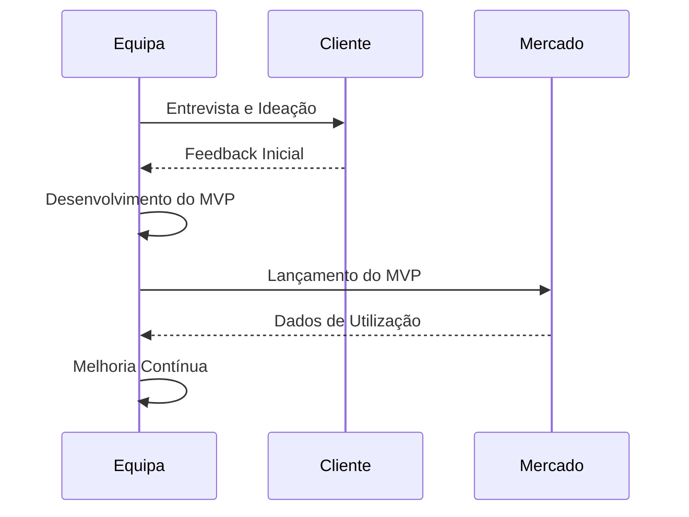

# O Futuro da Inovação Digital

A inovação contínua é o motor das empresas de sucesso. Mas como transformar boas ideias em produtos digitais inovadores que realmente impactam o mercado?

## Metodologias Ágeis

A utilização de frameworks como o Scrum ou Kanban permite às equipas iterar rapidamente e validar ideias com utilizadores reais antes de fazer grandes investimentos.

## Foco no Design Centrado no Utilizador (UX)

Produtos excelentes não são apenas funcionais, eles são fáceis e agradáveis de usar. Investir em UI/UX Design de ponta reduz o atrito e aumenta a retenção de utilizadores.

A inovação acontece na interseção entre a viabilidade tecnológica, a necessidade do utilizador e os objetivos de negócio.
