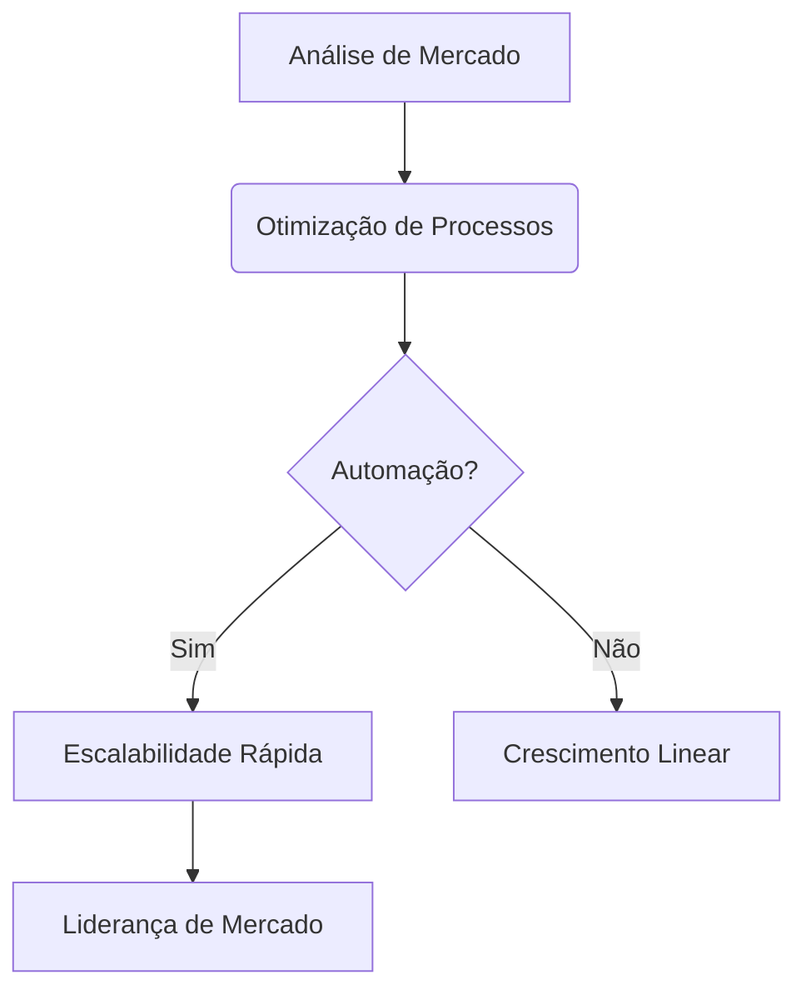

# Estratégias de Crescimento Corporativo

No cenário económico atual, crescer exige mais do que apenas um bom produto. É necessário ter uma estratégia robusta, apoiada por dados e automação de processos.

## Escalabilidade Inteligente

Para as empresas alcançarem o próximo nível, é preciso desenhar processos que funcionem independentemente do tamanho da equipa.

## O Papel da Tecnologia

Implementar sistemas ERP e CRM personalizados ajuda a manter a organização e o foco no cliente. Na HAPPi & Co, desenvolvemos sistemas sob medida que se adaptam exatamente ao modelo de negócios de cada cliente, garantindo que o software trabalhe para a empresa, e não o contrário.
