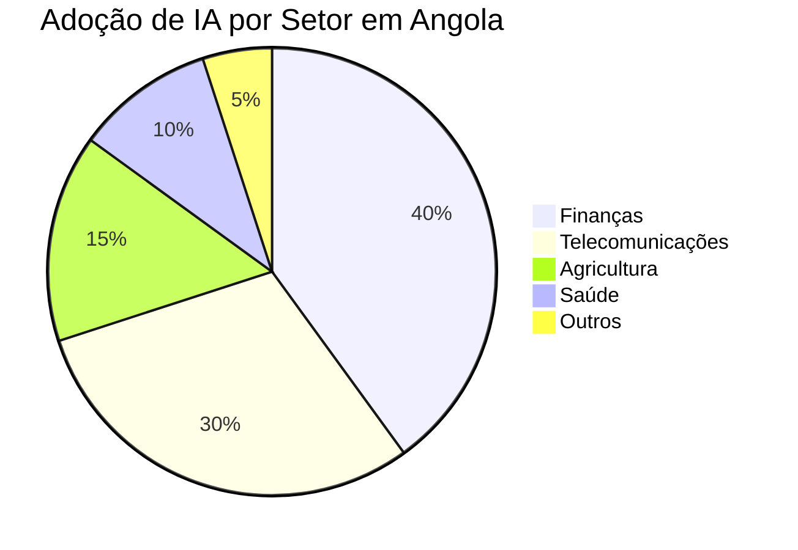

# Tendências Tecnológicas em Angola para 2024

A transformação digital está a avançar a passos largos em Angola. Com a expansão do acesso à internet e o crescimento de startups, o país prepara-se para um salto tecnológico em 2024.

## Adoção de Inteligência Artificial

Empresas angolanas estão, cada vez mais, a integrar IA nas suas operações diárias, desde atendimento ao cliente até análises preditivas na logística e agricultura.

## Infraestrutura Cloud

O abandono de servidores físicos locais em favor de soluções cloud (AWS, Azure) tem permitido maior escalabilidade para as empresas luandenses. A HAPPi & Co tem sido uma das parceiras chave nesta transição.

> "O futuro do mercado angolano passa pela digitalização dos processos e pela criação de soluções nativas focadas na nossa realidade." - Equipa HAPPi & Co

### Próximos Passos
As empresas que investirem agora em modernização tecnológica colherão os frutos de uma operação mais ágil e eficiente nos próximos cinco anos.
